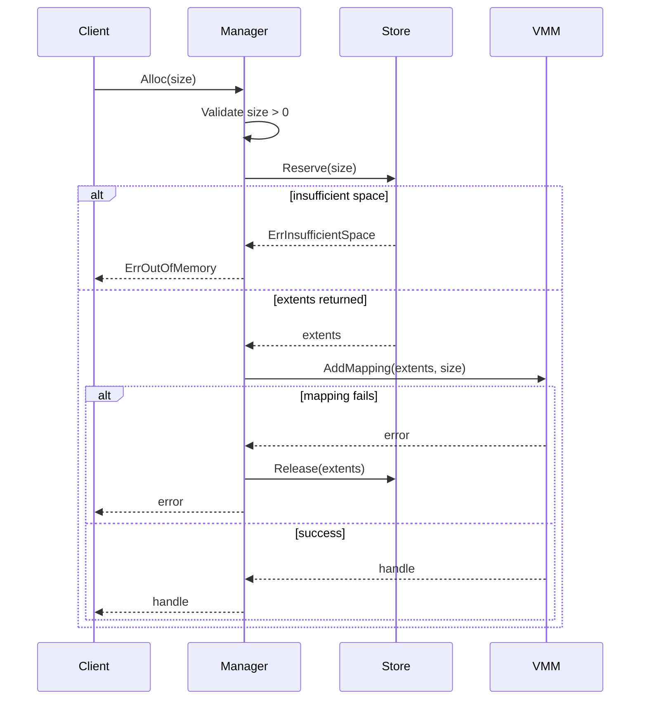
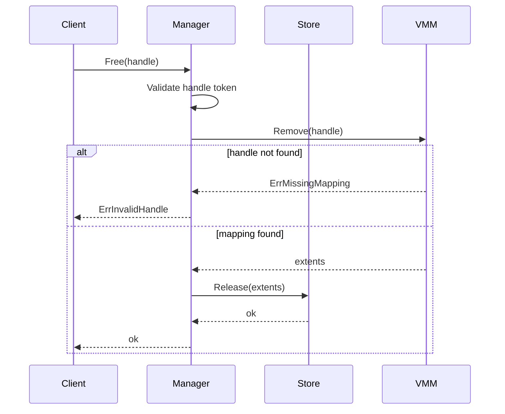
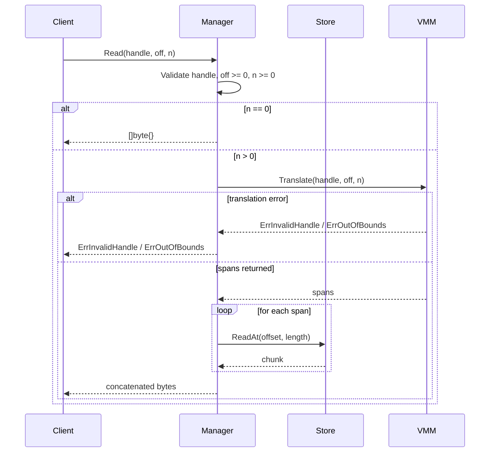
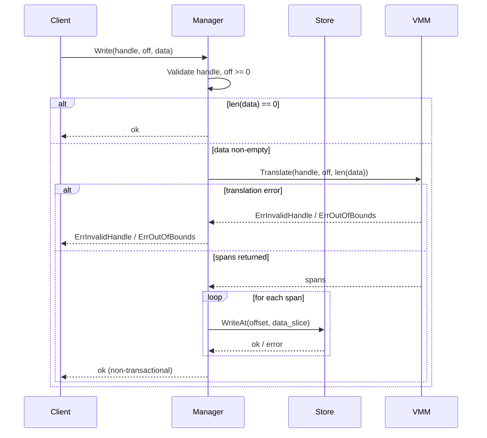

# Technical Specification

## 1. Key Terms

- **Disk**: Physical storage implemented as a byte array in memory.
- **Extent**: A contiguous free or allocated physical region on disk, represented by `Offset` and `Length`.
- **Free List**: The in-memory structure that tracks free extents available for future allocations.
- **Reserve**: Store-layer operation that accepts a requested size and returns one or more extents whose combined length satisfies that size.
- **Handle**: Opaque client-facing identifier for an allocated logical block.
- **Segment**: VMM mapping unit containing:
  - `LogicalStart`: offset in the client logical address space.
  - `PhysicalOffset`: offset in the disk byte array.
  - `Length`: mapped byte length.
- **VMM Table**: Mapping table from handle to ordered segments plus logical allocation size.
- **Physical Span**: Output of translation for a logical range, used by `Read` and `Write` to access disk.

## 2. Architecture Overview

The system is split into three cooperating components:

- **Manager layer**: Public API and orchestration logic.
- **Store layer**: Physical disk access and free-space management.
- **VMM layer**: Logical-to-physical address translation and handle mapping metadata.

Interaction model:

1. `Alloc` asks Store for physical extents.
2. Manager passes extents to VMM to create logical segment mapping.
3. `Read` and `Write` ask VMM to translate logical ranges into physical spans.
4. Manager executes physical reads or writes through Store using those spans.
5. `Free` removes mapping in VMM first, then returns physical extents to Store.

## 3. Store Layer

### 3.1 Disk

Disk is a bounded byte array with:

- `ReadAt(offset, n)`
- `WriteAt(offset, data)`
- `Len()`

All operations enforce bounds checks.

### 3.2 Free List and Extents

Free space is represented as sorted, non-overlapping extents.

`Reserve` behavior:

- First-fit traversal across free extents.
- May return multiple extents when contiguous space is unavailable.
- If reservation cannot satisfy total size, partial work is rolled back and insufficient space is returned.

`Release` behavior:

- Validates each returned extent.
- Reinserts extents in sorted order.
- Coalesces adjacent extents to reduce fragmentation.
- Rejects invalid overlaps.

## 4. VMM Layer

### 4.1 Purpose

VMM allows clients to treat allocations as logically contiguous even when physical storage is fragmented.

### 4.2 Segment Mapping

Each handle maps to an ordered segment list. Segments should cover logical range `[0, size)` without gaps.

### 4.3 AddMapping

Given extents and requested size, VMM:

1. Builds ordered segments with increasing logical offsets.
2. Verifies exact logical coverage.
3. Generates a new monotonically increasing handle ID.
4. Stores `handle -> segments` and `handle -> size` metadata.

### 4.4 Translate

`Translate(handle, off, n)`:

1. Validates range inputs.
2. Ensures handle exists and requested logical window is in bounds.
3. Produces ordered physical spans that correspond to logical bytes `[off, off+n)`.
4. Supports multi-span output when allocation is fragmented.

## 5. Manager Internal Operation Flows

### 5.1 Alloc(size)

1. Validate `size > 0`.
2. Call Store `Reserve(size)` to obtain physical extents.
3. Map Store insufficient-space error to public out-of-memory error.
4. Call VMM `AddMapping(extents, size)`.
5. If mapping fails, release extents back to Store as rollback.
6. Return opaque handle on success.

Component ownership:

- **Manager**: validation, orchestration, rollback, error normalization.
- **Store**: physical extent reservation.
- **VMM**: handle allocation and mapping persistence.

### 5.2 Free(handle)

1. Validate handle token.
2. Call VMM `Remove(handle)` first to obtain authoritative extents.
3. Missing mapping returns public invalid-handle error.
4. Pass returned extents to Store `Release`.
5. Store performs insert and coalescing internally.
6. Return success only if both mapping removal and release succeed.

Component ownership:

- **Manager**: flow control and public error mapping.
- **VMM**: mapping lifecycle and extent recovery.
- **Store**: free-space reintegration and coalescing.

### 5.3 Read(handle, off, n)

1. Validate handle, `off >= 0`, `n >= 0`.
2. Fast path: `n == 0` returns empty bytes.
3. Call VMM `Translate(handle, off, n)`.
4. Normalize translation errors to public invalid-handle or out-of-bounds.
5. For each translated span, call Store `ReadAt`.
6. Concatenate chunks in span order and return bytes.

Guarantee: Logical byte order is preserved even across multiple physical spans.

### 5.4 Write(handle, off, data)

1. Validate handle and `off >= 0`.
2. Fast path: empty `data` returns success.
3. Call VMM `Translate(handle, off, len(data))`.
4. Normalize translation errors to public invalid-handle or out-of-bounds.
5. Slice payload according to span lengths.
6. Call Store `WriteAt` for each span in order.

Note: `Write` is not transactional across spans in v1. If a later span fails, earlier writes remain applied.

## 6. Error Model

Public layer exposes stable errors for:

- Invalid size
- Out of memory
- Invalid handle
- Out of bounds

Internal Store and VMM errors are translated by Manager into these API-level semantics.

Current behavior: unknown handle and double free both surface as invalid handle.

## 7. Core Invariants

- Manager is the only public orchestration boundary.
- Store does not know handles or logical offsets.
- VMM does not read or write disk bytes.
- `Free` must remove mapping in VMM before releasing extents to Store.
- Active mapping segments for a handle must represent full logical coverage without gaps.
- Fragmented physical placement is transparent to callers.

## 8. Known Limitations

- **Thread Safety**: The system provides no synchronization. Concurrent calls to any public API are not safe and may produce undefined behavior.

- **Handle ID Overflow**: Handle IDs are generated as monotonically increasing `uint64` values. Under a sufficiently large number of allocations, the counter will wrap around, potentially producing a handle ID that collides with an active mapping.

- **Partial Write Failures**: `Write` is not transactional across multiple spans. If a `WriteAt` call succeeds for an earlier span but fails for a later one, the applied bytes are not rolled back, leaving the allocation in a partially updated and potentially corrupt state.
